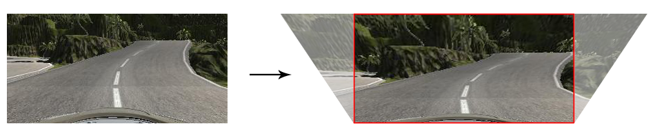

# **Behavioral Cloning**

---

## Project

The goals / steps of this project are the following:
* Use the simulator to collect data of good driving behavior
* Build, a convolution neural network in Keras that predicts steering angles from images
* Train and validate the model with a training and validation set
* Test that the model successfully drives around track one without leaving the road
* Summarize the results with a written report

---

## Simulator

Udacity provided a simulator with 2 tracks.

The simulator has two modes:
* **Training:** In training mode the car can be driven around the tracks by the user and the simulator records three images mounted in the center, left and right of the car and steering angle, throttle, brake and speed values for each frame.
* **Autonomous:** In autonomous mode the simulator connects to an external program (drive.py), sends the image from the center mounted camera, the current speed and throttle position. The drive.py program uses the image to predict the steering angle based on a trained [Keras](https://github.com/fchollet/keras) model and calculates the updated throttle position to maintain a predefined speed. The steering angle and throttle position are then sent back to the simulator.

---

## Track 1

---

### Training Data Collection

After some failures and experimentation it became apparent that the quality of the training data is important to successfuly train the model.

I have found the XBOX controller to work best as an input method, but I don't play video games so it's been a challenge to drive the car around the track in the middle of the lane. I decided to "improve" the analog stick by attaching a 3d printed extension.

Data collected:
* 2 laps in normal direction, trying to stay in center of lane
* 2 laps in reverse direction
* recovery clips for exiting first turn, entering bridge, sharp turns

---

### Preprocessing

I created a separate preprocessing module (preprocess.py) to make sure that images are preprocessed the same way during training and prediction.

I tested several image spaces and found that converting the images to HLS provided the greatest improvement. This is one of the recorded images in RGB and HLS (displayed hue displayed as red, lightness as green, saturation as blue):

I also cropped the bottom and top of the images to get rig of the front of the car and sky (lightness channel only):

Additionally images are resized to 25% of their size (20,80,3) and normalized to zero mean and unit variance (values -0.5...0.5).

Statistics:
* samples colleted: 4866
* samples driving straight: 1068
* images with steering: 3798
* augmented samples: **9732**

---

### Data augmentation

When the steering wheel is centered (absolute value of steering is less than 0.001) I used the left and right camera images only with a low steering value to steer the car towards the center:

*left camera, steering value 0.065*

*right camera, steering value -0.065*

When the steering wheel is turned, only the center image is used. To make sure that the data set is balanced for left and right steering values, the image is also flipped horizontally and the steering value's sign negated:

*center camera, steering value -0.5*

*flipped center camera, steering value 0.5*

---

### Initial model

My model was inspired by NVIDIA's model from their [End-to-End Deep Learning for Self-Driving Cars](https://devblogs.nvidia.com/parallelforall/deep-learning-self-driving-cars/) article.

My graphics card does not have enough memory to run NVIDA's model and their model required a specific input image size so I have reduced the number of [convolutional layers](https://keras.io/layers/convolutional/#conv2d) and changed the padding to 'same' to allow more flexible experimentation with input image sizes.

I have added [max pooling](https://keras.io/layers/pooling/#maxpooling2d) and [dropout](https://keras.io/layers/core/#dropout) layers to prevent overfitting. Convolutional layers use RELU activation to allow non-linear training.

The model uses Adam optimizer with MSE (mean squared error) loss function.

My initial model architecture:

| layer                 |  parameters        | output       |
|:---------------------:|:------------------:|:------------:|
| Input                 | image              | 20, 80, 3    |
| Convolution RELU 1    | K=3, S=1, D=16     | 20, 80, 16   |
| MaxPooling            | K=2, S=2           | 10, 40, 16   |
| Convolution RELU 2    | K=3, S=1, D=32     | 10, 40, 32   |
| MaxPooling            | K=2, S=2           | 5, 20, 32    |
| Convolution RELU 3    | K=3, S=1, D=64     | 5, 20, 64    |
| MaxPooling            | K=2, S=2           | 2, 10, 64    |
| Dropout               | 0.2                |              |
| Flatten               |                    | 1280         |
| Dense                 |                    | 1000         |
| Dense                 |                    | 100          |
| Dense                 |                    | 50           |
| Dense                 |                    | 10           |
| Dense                 |                    | 1            |

**Total parameters:** 1,410,255

The model uses 20% of the samples for validation.

---

### Initial Result

The assets are located in the **track1_1** folder:
* **clone.py** - model training
* **drive.py** - steering prediction for simulator
* **preprocess.py** - image preprocessing used by clone.py and drive.py
* **model.h5** - keras model data
* **track1_1.mp4** - screen recording from simulator

Youtube video:

---

### Improvements

I wanted to improve on my initial result because the car was not driving very smoothly. I collected additional driving data by driving the car around the track an additional time.

Sample statistics:
* samples colleted: 7,540
* samples driving straight: 1,957
* images with steering: 5,583
* augmented samples: **15,080**

I also added another convolutional layer and dropouts after each convolution. My revised model:

| layer                 |  parameters        | output       |
|:---------------------:|:------------------:|:------------:|
| Input                 | image              | 20, 80, 3    |
| Convolution RELU 1    | K=3, S=1, D=8      | 20, 80, 8    |
| MaxPooling            | K=2, S=2           | 10, 40, 8    |
| Dropout               | 0.1                |              |
| Convolution RELU 2    | K=3, S=1, D=16     | 10, 40, 16   |
| MaxPooling            | K=2, S=2           | 5, 20, 16    |
| Dropout               | 0.1                |              |
| Convolution RELU 3    | K=3, S=1, D=32     | 5, 20, 32    |
| MaxPooling            | K=2, S=2           | 2, 10, 32    |
| Dropout               | 0.1                |              |
| Convolution RELU 4    | K=3, S=1, D=64     | 2, 10, 64    |
| MaxPooling            | K=2, S=2           | 1, 5, 64     |
| Dropout               | 0.1                |              |
| Flatten               |                    | 1280         |
| Dense                 |                    | 1000         |
| Dense                 |                    | 100          |
| Dense                 |                    | 50           |
| Dense                 |                    | 10           |
| Dense                 |                    | 1            |

**Total parameters:** 451,199

The assets are located in the **track1_2** folder:
* **clone.py** - model training
* **drive.py** - steering prediction for simulator
* **preprocess.py** - image preprocessing used by clone.py and drive.py
* **model.h5** - keras model data
* **track1_2.mp4** - screen recording from simulator

Youtube video:

---

## Track 2

---

### Challenges

Track 2 is more challenging because the turns are sharper, the track is longer, there track changes to deep downhill sections where the camera can't see the road and there are more dynamic lighting situation.

Due to my lacking experience with the game controller I collected data with the car running at 15 mph.

---

### Additional Preprocessing

#### Shadows

There are lighting scenarios where part or all of the track is in shadow. I've used CLAHE ([Contrast Limited Adaptive Histogram Equalization](https://en.wikipedia.org/wiki/Adaptive_histogram_equalization)) on the lightness channel to minimize the affect of shadows.

lighness channel

lighness channel with CLAHE applied

#### Roadside Distractions

There are a lot of distracting features on the sides of the road, for example trees. To minimize this I have use a projection transformation to "un-tilt" the images:

#### Tagging Good Samples

NVIDIA's [End-to-End Deep Learning for Self-Driving Cars](https://devblogs.nvidia.com/parallelforall/deep-learning-self-driving-cars/) article mentions that they only use center lane driving samples. To make that sure I am training the model on good data, I wrote a small python program to play through the samples and tag samples to use or ignore.

The **tag_data.py** script loads a folder of samples recorded by the simulator and displays the frames, frame numbers and steering angle in a window. The frames can be played forward and back (**left** and **right** arrow keys) and tagged for use (**up** arrow) or ignore (**down** arrow).

The bottom bar's color indicates if a frame should be used: red for good data and gray for the sample to be ignored.

The **return** key saves a driving_log_marked.csv file that has an extra boolean attribute.

The left image (frame 0, steering angle 0) should be ignored, the right image (frame 96, steering angle 0.8) should be used.

---

### Model Architecture

I have changed the activation for convolutional layers to [ELU](http://image-net.org/challenges/posters/JKU_EN_RGB_Schwarz_poster.pdf), doubled the depth of convolutional layers and doubled the input image size to 32x160x3.

The data is reshuffled between epochs to avoid validating to the same set of images.

My final model architecture:

| layer                 |  parameters        | output       |
|:---------------------:|:------------------:|:------------:|
| Input                 | image              | 32, 160, 3   |
| Convolution ELU 1     | K=3, S=1, D=8      | 32, 160, 8   |
| MaxPooling            | K=2, S=2           | 16, 80, 8    |
| Dropout               | 0.2                |              |
| Convolution ELU 2     | K=3, S=1, D=16     | 16, 80, 16   |
| MaxPooling            | K=2, S=2           | 8, 40, 16    |
| Dropout               | 0.2                |              |
| Convolution ELU 3     | K=3, S=1, D=32     | 8, 40, 32    |
| MaxPooling            | K=2, S=2           | 4, 20, 32    |
| Dropout               | 0.2                |              |
| Convolution ELU 4     | K=3, S=1, D=64     | 4, 20, 64    |
| MaxPooling            | K=2, S=2           | 2, 10, 64    |
| Dropout               | 0.2                |              |
| Flatten               |                    | 1280         |
| Dense                 |                    | 1000         |
| Dense                 |                    | 100          |
| Dense                 |                    | 50           |
| Dense                 |                    | 10           |
| Dense                 |                    | 1            |

**Total parameters:** 1,411,583

---

